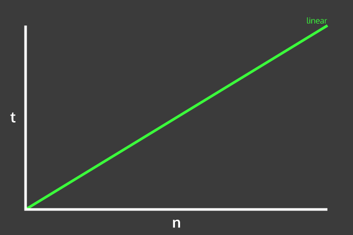

## What is Big O?
* Big O, also known as time & space complexity, is a way computer scientists measure how memory efficient or fast an algorithm is as the given input grows larger & larger.
* This is really just fancy CS talk for: We want our algorithms to run as quickly as possible, and use as little computer memory as possible. As the input scales towards infinity.
* Big O analysis is often a big part of interviews - many interviewers will expect you to be able to analyze how efficient your code is. Don't be intimidated! Analyzing time and space complexity is not as insane as it may sound to you at this point!
* **Instructor Note**: Explain to the students that we will only cover time complexity in this short lesson, space complexity will be covered in the next lesson.

### But Wait, What in the World is an Algorithm?
* An algorithm, or algo, is just a function or collection of functions that accomplish a specific task.
* For example, we have all used Google. Google uses a extremely powerful search algorithm in order to find your results as fast as possible when you search for something!
* Another algo you may have been exposed to at this point is Bubble Sort. Bubble sort is an inefficient, but basic, sorting algorithm. More on its inefficiencies later!

### Big O - Time Complexity
* In calculating how efficient algorithms are time wise, we need to evaluate how many operations the algo must utilize to return a result. There is a best-case, worst-case, and average case scenario. Today, we will not focus much on these separate cases, instead looking at the 'approximate' worst-case scenario.
* In a simple sense, Big O describes, in a CS way, how code will respond to different inputs. Will it be much slower if we give it a 10,000 item long input, or even a million item long input?

### Time Complexity
* Answer the following questions be referencing the below function `searchThroughArray`
1) Is this an algorithm? Why?
2) In the worst case, how many times will the for loop run?
3) What is the best case for times?

```javascript
function searchThroughArray(arrayOfIntegers, targetInteger){
  for (var i = 0; i < arrayOfIntegers.length; i++) {
    if(arrayOfIntegers[i] === targetInteger){
      return true;
    }
  }
  return false;
};

```

### How Big O is Expressed
* **The time complexity of this algo can be expressed as O(n).**
* Explain to students that all time complexity is expressed as the function O (Hence, big O).
* The (n) part describes how many times we will have to "visit", or look at, each element of the input. In the worst case, we must look at every single item in the array. Once.
* Expound on worst case scenario
* list the common big O expressions(constant, linear, logarithmic, exponential, etc)

##### Linear Time Graph


### Activity 2 - returnLastElement()
  * Answer the following questions with a partner, referencing the below function `returnLastElement`
  1) How many operations does this function do when given an array of length 5?
  2) How many operations does this function do when given an array of length 10,000?
  2) What do you think the Big O time complexity of this algorithm?

```javascript
function returnLastElement(array){
  return array[array.length - 1]
}
```

### Activity - Go Over Bubble Sort & Its Time Complexity

```javascript
function bubbleSort(array) {
  var length = array.length;
  for (var i = 0; i < length; i++) { //Number of passes
    for (var j = 0; j < (length - i - 1); j++) { //Notice that j < (length - i)
      //Compare the adjacent positions
      if(array[j] > array[j+1]) {
        //Swap the numbers
        var temp = array[j];  //Temporary variable to hold the current number
        array[j] = array[j+1]; //Replace current number with adjacent number
        array[j+1] = temp; //Replace adjacent number with current number
      }
    }        
  }
}

// declare a variable that will act as a flag to let us know once the array has
// finished sorting
var sorted;

function bubbleSort(arr) {
  // everytime we iterate over the array, we know at least the last value has
  // been sorted, so we don't have to iterate to that index again
  var end = arr.length - 1;
  // set flag to true, if we have to swap any values, the flag will be then set
  // to false
  sorted = true;
  for (var i = 0; i < end; i++) {
    // if the value of the current index is less than the next index, we know
    // the list is not properly sorted and swap their positions.
    if (arr[i] > arr[i + 1]) {
      // we have to create a temporary variable to hold a value, so we can swap
      // the values of the two positions
      var temp = arr[i];
      arr[i] = arr[i + 1];
      arr[i + 1] = temp;
      sorted = false;
    }
  }
  end--;
}

do {
  bubbleSort(unsortedArr);
} while (!sorted);

```

* If you're iffy about doing this, here is a digital demonstration: https://upload.wikimedia.org/wikipedia/commons/c/c8/Bubble-sort-example-300px.gif

* This means we are performing many operations on each element by using nested `for` loops.
* Explain that we are performing n operations on each element, where n in the length of the input array
* This leads to a time complexity of O(n * n), or O(n<sup>2</sup>).
* Also mention to students that generally, nested `for` loops lead to O(n<sup>2</sup>) time complexity.
_**Instructor: Field questions at this point.**_

** If students want more on Bubble Sort & its time complexity, slack them this link at the end of class. http://codingmiles.com/sorting-algorithms-bubble-sort-using-javascript/. It goes through Bubble Sort step by step & covers it's Time Complexity in detail. For  now, more on to analyzing it.
